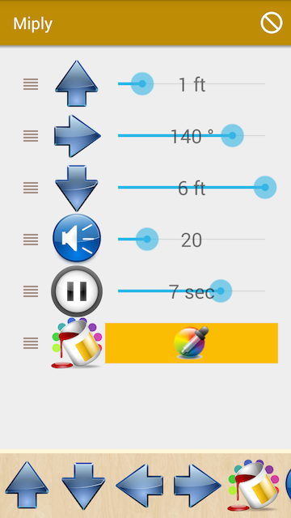

Miply
======
**Miply** is a simple Android programming environment for your MiP robot. 

#### Screenshot

#### Works on 
Android 4.4 or higher. Tested on Amazon Fire Phone.

## Usage
Click the icons at the bottom to add the action to the MiP's program. You can then drag the rows to re-order instructions.
Initially a crossed out circle is shown in the top-right corner and the app automatically tries to connect to the first available MiP in range. When a connection has been made the icon changes to a play arrow. Press the Play arrow to execute all instructions in the list.

## License 
* see [LICENSE](LICENSE.md) file
